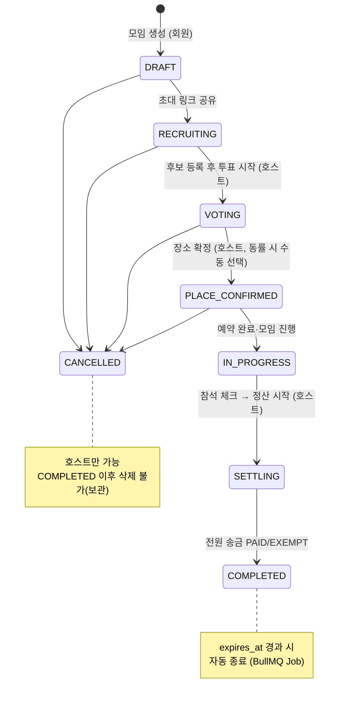
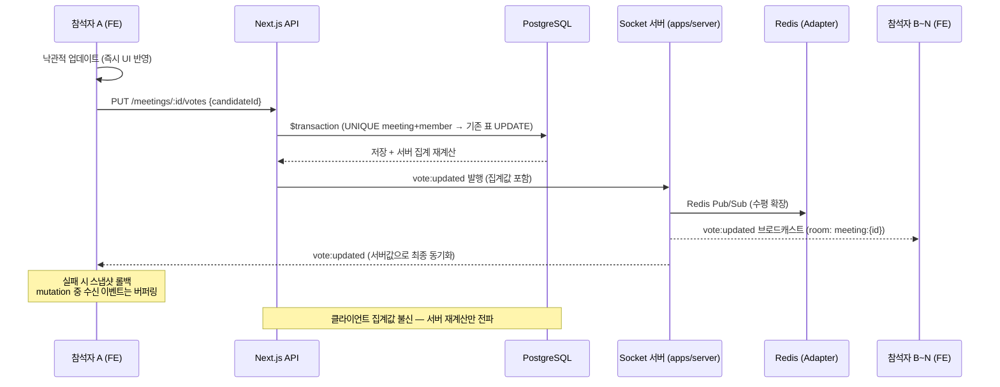
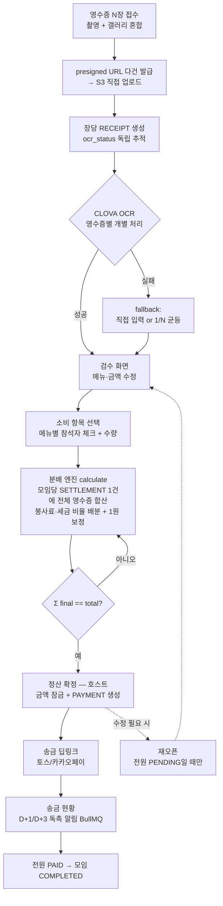
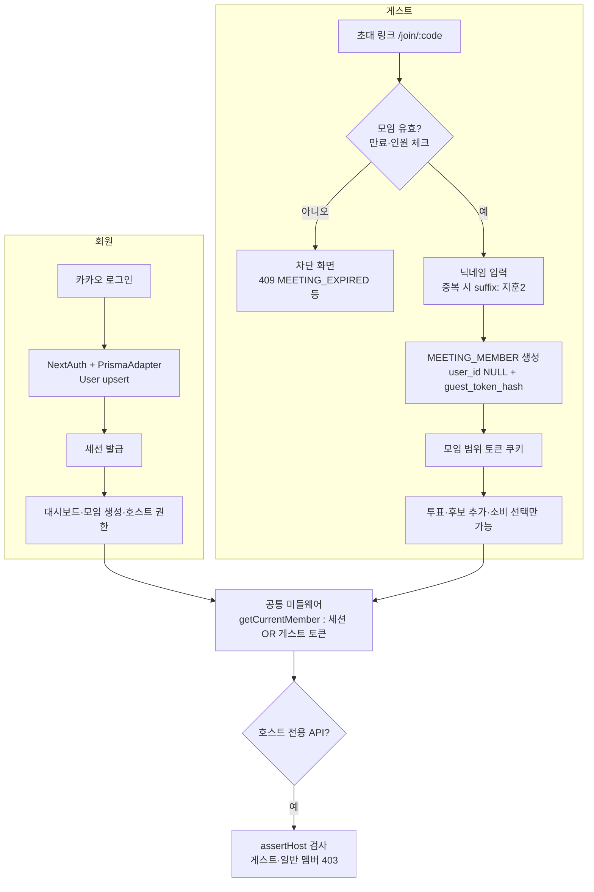

# 얌피 핵심 다이어그램

> 산출물 ③. ERD는 `docs/erd-v2.2.md` 참조.

## 1. 모임 상태 머신

전 도메인이 공유하는 핵심 규칙. 건너뛰기·역행 시 `409 INVALID_MEETING_STATUS_TRANSITION`.

## 2. 실시간 투표 시퀀스 (REST 저장 + Socket 전파)

## 3. 정산 파이프라인 (다중 영수증 → OCR → 분배 → 송금)

## 4. 인증 플로우 (카카오 회원 + 게스트)

> 게스트 인증 구현 방식(NextAuth JWT vs 자체 토큰)은 ① 담당 결정 대기 — 위 플로우는 자체 토큰(b안) 기준이며, (a)안 채택 시 G5~G6만 NextAuth 세션으로 대체된다.
