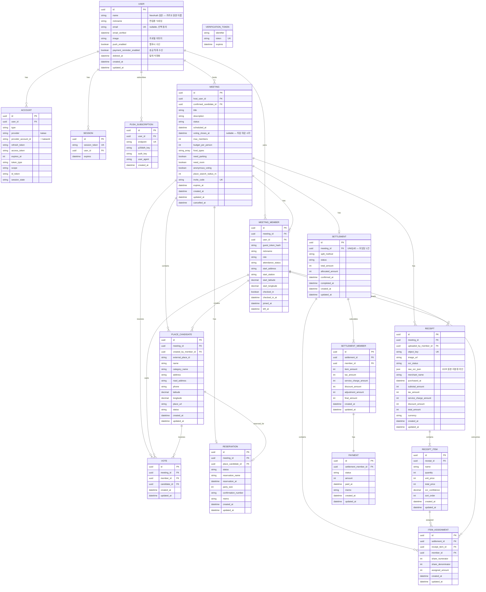

# 얌피 ERD v2.2 — 확정본

> 기준: ERD v2.1 + 구조 보완(2026-06-15) 결정 반영. **이 파일이 Prisma 스키마 작성의 단일 기준이다.** (v2.1 대체)
> 관련: `yummpi_prd_v2.1.md` · `api-spec.md`(동기화 필요) · `erd-보완안-v2.2.md`(결정 근거)

## v2.1 → v2.2 변경 이력

| # | 변경 | 이유 |
| --- | --- | --- |
| 1 | USER에서 `auth_provider`·`provider_account_id` **제거** | 인증 provider 정보는 NextAuth `Account` 테이블로 이전. kakaoId는 `account.provider_account_id`(provider='kakao')에서 조회 |
| 2 | **Account · Session · VerificationToken 추가** | 카카오 로그인을 NextAuth v5 PrismaAdapter + DB 세션으로 구현 → 어댑터 표준 테이블 필수 |
| 3 | 게스트 인증 **자체 토큰(b안) 확정** | NextAuth Credentials는 DB 세션과 호환 불가. 게스트는 NextAuth 미사용, `meeting_members.guest_token_hash` 활용 (스키마 변경 없음) |
| 4 | USER에 `deleted_at` 추가 | 삭제정책: 탈퇴는 익명화 후 기록 보존 |
| 5 | USER에 `nickname`·`push_enabled`·`payment_reminder_enabled` 추가 | 편집용 닉네임(어댑터 `name`과 분리) + 마이페이지 알림 설정(boolean 2개) |
| 6 | **PUSH_SUBSCRIPTION 추가** | F10 웹푸시 구독 저장(⑤). VAPID 구독 정보 보관 |
| 7 | MEETING에 `voting_closes_at`(nullable) 추가 | PRD F4 시간 기반 투표 마감. 자동 마감 Job은 P1 |
| 8 | RECEIPT에 `raw_ocr_json`(JSON) 추가 | F7 검수 화면 "미분류 텍스트 영역" + OCR 원본 보관(④) |
| 9 | RESERVATION 예약 담당자 FK **추가 안 함** | 예약 상태 변경 권한을 **호스트로 통일**(`assertHost`) |

**불변식 (앱 레벨 강제)** — v2.1 유지 + 추가
- `vote.candidate.meeting_id == vote.meeting_id`
- `reservation.place_candidate.meeting_id == reservation.meeting_id`
- `meeting.host_user_id` ↔ `meeting_members(role=HOST).user_id` 항상 일치 (모임 생성 시 HOST 멤버 자동 생성)
- 확정 장소의 단일 진실은 `meeting.confirmed_candidate_id`
- `receipt: subtotal + tax + service_charge − discount == total`
- `settlement.total_amount == SUM(meeting의 모든 receipt.total_amount)`
- 카카오 회원의 kakaoId = `account.provider_account_id` WHERE `provider='kakao'` (USER에 중복 저장 안 함)

**정산 단계별 잠금 규칙** — v2.1과 동일.

**⚠️ NextAuth 테이블 예외 규칙**: Account/Session/VerificationToken은 어댑터가 필드명을 전제하므로, snake_case는 `@map()`으로만 맞추고 **모델 필드명은 어댑터 표준 유지**. (프로젝트 snake_case 규칙의 유일한 예외)

## ERD (Mermaid)



## 제약조건 (v2.2)

```
users.email                                      UNIQUE, NULL 허용
accounts(provider, provider_account_id)          UNIQUE                       ★ v2.2 추가
sessions.session_token                           UNIQUE                       ★ v2.2 추가
verification_tokens(identifier, token)           UNIQUE                       ★ v2.2 추가
push_subscriptions.endpoint                      UNIQUE                       ★ v2.2 추가
meetings.invite_code                             UNIQUE
meetings.confirmed_candidate_id                  UNIQUE
meeting_members(meeting_id, user_id)             UNIQUE WHERE user_id IS NOT NULL (부분 인덱스)
place_candidates(meeting_id, external_place_id)  UNIQUE
votes(meeting_id, member_id)                     UNIQUE (단일 선택 — 변경은 UPDATE)
reservations.meeting_id                          UNIQUE (모임당 1예약)
receipts.object_key                              UNIQUE
settlements.meeting_id                           UNIQUE (모임당 1정산)
item_assignments(settlement_id, receipt_item_id, member_id) UNIQUE
settlement_members(settlement_id, member_id)     UNIQUE
payments.settlement_member_id                    UNIQUE
```

## 타입·삭제 규칙 (v2.0 유지)

- 금액: **INTEGER**(원 단위). FLOAT/DECIMAL 금지.
- 좌표: **DECIMAL(10,7)**.
- 삭제: Meeting 소프트삭제(`cancelled_at`) · Receipt→Item·Settlement→하위 Cascade · User 탈퇴는 익명화(`deleted_at`) 후 보존.
- 부분 인덱스(`meeting_members`)는 Prisma 기본 미지원 → **raw migration으로 보정**.

## 인증 구조 요약 (v2.2 확정)

- **회원(카카오)**: NextAuth v5 + PrismaAdapter + **DB 세션**. provider 정보는 Account, 세션은 Session. kakaoId = `account.provider_account_id`.
- **게스트(b안)**: NextAuth 미사용. `POST /auth/guest`에서 모임 범위 서명 토큰 발급 → 쿠키. 해시는 `meeting_members.guest_token_hash`. `users` 미생성.
- 공통 미들웨어 `getCurrentMember`: NextAuth 세션 OR 게스트 토큰 해석. 호스트 전용은 `assertHost`.

## 후속 동기화 필요 (문서)

1. `api-spec.md` — 예약 권한 "호스트 또는 예약 담당자" → **"호스트"** 정정, 게스트 인증 b안 명시, 신규 테이블 참조.
2. `packages/schemas` enum — v2.2/API 스펙 기준으로 ⑤와 교정.
3. CLAUDE.md DB 규칙 표 — 신규 UNIQUE 제약 반영(선택).
